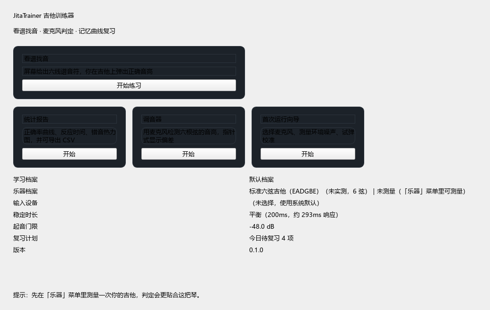

# JitaTrainer 吉他训练器

> 一个常驻 Windows 桌面的吉他指板训练器：屏幕用六线谱给出一个音符，你在吉他上把它弹出来，程序通过麦克风听音判断对错，答对即出下一题，并按记忆曲线安排复习与易错强化。

**English**: JitaTrainer is a Windows desktop ear-and-fretboard trainer for guitar. It shows a note in guitar TAB, listens through your microphone, judges whether the note you played is correct, then moves on — while scheduling reviews of your weak notes with a spaced-repetition model.

**上手请看 [软件使用说明（图文版）](docs/软件使用说明.md)。**



---

## 它解决什么问题

练琴时最常见的问题是：不知道自己弹得对不对，也不知道自己哪个音、哪个把位最不熟。JitaTrainer 把「看谱 → 找到音 → 弹出来」做成一个即时闭环，并长期记录你的薄弱点，反复喂给你练。

## 当前版本功能

| 功能 | 说明 |
|---|---|
| **看谱找音** | 屏幕以六线谱（6 线 + 品格数字）给出目标音符，你在吉他上弹出它；弹对自动出下一题，弹错提示并停留 |
| **麦克风判定** | 实时采集 + YIN 基频检测 + 谐波校验，判定只认**音名**（与弦、品、八度无关） |
| **难度分级** | 按把位自选：0–3 品 / 0–5 品 / 0–7 品 / 全指板 0–12 品 |
| **三种练习模式** | 固定题量（10/20/30/50/100 题）、固定时长（5/10/15/30/45 分钟）、自由练习 |
| **超时可选** | 自动换题并显示**倒计时**；或改成**人工推进**，按回车自己进入下一个音 |
| **宽容期** | 出题后 0–5 秒内弹错不判错（方便试音），但弹对立即算对；界面显示「试音中」 |
| **即时反馈** | 答错时高亮标准位置、显示"你弹的是 X，需要 Y"，并停留到弹对为止 |
| **易错强化** | 记录每个「音名 × 把位区间」的错误率与反应时间，薄弱项加权复现 |
| **记忆曲线** | 简化 SM-2 间隔重复（0/1/3/7/16/35/75/160 天），跨天到期复习、错题回炉 |
| **难度建议** | 连续几次达到正确率与反应时间门槛时，提示可以进入下一难度（只建议，不自动切换） |
| **统计报告** | 正确率曲线、逐日练习时长、错音热力图、时段对比、最需加强项，CSV 导出 |
| **调音器** | 指针式显示六根弦的音准偏差 |
| **测量向导** | 测出你这把琴每根弦的实际情况，生成专属**乐器配置档案**，判定策略随之调整 |
| **账号隔离** | 多人共用一台电脑，各自独立的进度、记忆曲线与统计 |
| **中英双语** | 界面文案中英文可切换 |
| **绿色便携** | 单文件夹免安装、免管理员权限、运行时不联网；数据存程序目录，拷走即带走全部进度 |

**暂不包含**（后续扩展方向）：音阶与调式练习、和弦与和弦转换、节奏与节拍训练、
听音训练、五线谱视奏。

## 一条重要的产品事实

麦克风**只能听出音高**，无法知道你按的是哪根弦、哪个品。因此：

> 当题目标注「第 5 弦第 2 品」时，你在别的弦上弹出同样的音**也算通过**。标注位置的作用是帮你建立指板地图，而不是限制你必须按在那里。

这条原则决定了判定引擎与数据结构的设计（判定只认音名）。

## 运行环境

- Windows 10 1809+ / Windows 11（x64）
- 免安装、免管理员权限、运行时不联网
- 推荐：木吉他 + 外接 USB 麦克风（蓝牙耳机/音箱的麦克风不可用，见使用说明）

## 快速开始

1. 把 `JitaTrainer` 文件夹解压到任意位置（中文路径、带空格路径都可以）；
2. 双击 `JitaTrainer.exe`，按首次运行向导选麦克风、测环境噪声；
3. 菜单「**乐器 → 测量我的吉他**」测一次你的琴（约 20 秒），生成专属配置档案；
4. 首页点「看谱找音」开始练习，结束后可在「统计报告」里看曲线与错音分布。

详细的图文步骤见 **[软件使用说明](docs/软件使用说明.md)**。

## 文档

- **软件使用说明（图文版）**：[docs/软件使用说明.md](docs/软件使用说明.md) — 推荐先读这个
- 用户手册（条目式）：[docs/用户手册.md](docs/用户手册.md) — 参数含义、快捷键、故障排查
- 需求文档（PRD）：[docs/需求文档.md](docs/需求文档.md)
- 技术方案：[docs/技术方案.md](docs/技术方案.md)
- 开发过程记录：[docs/开发记录/](docs/开发记录/) — 每个里程碑的过程档案、缺陷诊断与验证数据
- 交接说明：[docs/开发记录/交接说明-2026-10-07-M1暂停.md](docs/开发记录/交接说明-2026-10-07-M1暂停.md)
- 对话记录归档：[docs/对话记录/](docs/对话记录/) — 人机问答与决策溯源（脱敏）

## 工具一览

| 工具 | 用途 |
|---|---|
| `python tools/doctor.py --audio --tests` | **环境自检**：依赖、临时目录、运行期目录、git、音频设备，可选跑测试 |
| `python tools/mic_check.py --list` | 麦克风实时电平条与可用性判定（录音前先验证设备） |
| `python tools/analyze_recording.py <文件> --order 6,5,4,3,2,1` | 录音逐弦分析 + 低频响应诊断（支持 m4a/mp3/wav） |
| `python tools/capture_fixture.py --analyze x.wav --segments` | 录音分段识别与回归固件生成 |
| `python tools/pitch_bench.py` | 音高算法基准（窗口 × 噪声 × 精度 × 判定路径） |
| `python tools/build.py --clean` | 打包绿色版并自动运行产物自检 |
| `python tools/sync_github.py push` | 同步到 GitHub（自动探测代理） |

## 已验证的技术指标（M0 实测）

音高检测采用自实现 YIN + 保守型谐波校验，参数全部由基准测试选定（[tools/pitch_bench.py](tools/pitch_bench.py)）：

| 指标 | 实测结果 |
|---|---|
| 单帧识别精度（吉他音域） | 误差 ≤ 0.4 音分 |
| 端到端判定延迟 | 282.7 ms（窗口 2048 帧 + 稳定 200ms） |
| **判错次数（112 个样本，含 10dB 噪声）** | **0 次**（噪声下只会"拒绝判定"，不会误判） |
| 单帧检测耗时 | 0.5–0.7 ms（10ms 帧预算的 5–7%） |
| 分析窗口硬约束 | ≥ 1371 帧（E2 周期 582.5 帧 ×2，fmin=70Hz） |

## 开发环境

```powershell
# 依赖（开发期需要联网一次；运行时完全离线）
python -m pip install PySide6 sounddevice numpy pyinstaller pytest

# 运行（开发模式）
python run.py

# 离屏自检（验证数据库、语言包、音频设备枚举）
python run.py --selftest

# 测试
python -m pytest

# 构建绿色版（自动运行产物自检）
python tools/build.py --clean
```

### 本机环境的两个坑（已内置兼容处理）

1. **pip 不可用**：本机 Windows 权限模型下，`os.mkdir(path, 0o700)` 与
   `tempfile.mkdtemp()` 创建的目录 ACL 损坏、无法读写（`icacls` 也无法处理），
   而 pip 内部正是用 `mkdtemp` 解包，因此必然失败。
   因此依赖改为**解包官方 wheel 到 `.vendor/`**（已被 `.gitignore` 排除），
   `run.py` 与 `conftest.py` 会把 `.vendor` 与 `src` 加入 `sys.path`。
2. **pytest 临时目录**：pytest 自带 basetemp 机制同样会创建 0o700 目录并在
   会话结束时对其清理，在本机会导致整个测试会话崩溃。
   已在 `conftest.py` 中接管 `tmp_path` 夹具，把临时目录固定在工作区内的
   `.tmp/tests/`，完全绕开 pytest 的临时目录回收逻辑。

`src/jitatrainer/compat.py` 在运行期自动探测并修补 `tempfile.mkdtemp`，
使第三方库（含 PyInstaller）也能正常工作。

## 仓库同步

```powershell
python tools/sync_github.py ensure            # 确保远程仓库存在
python tools/sync_github.py push              # 推送当前分支
python tools/sync_github.py tag m1-foundation # 打里程碑标签并推送
```

访问令牌读取自 `.secrets/github_token.txt`（已被 `.gitignore` 排除，**永不提交**）。

## 第三方依赖与许可

PySide6 (LGPLv3) · sounddevice (MIT) · numpy (BSD) · scipy (BSD)。完整声明见 `THIRD_PARTY_LICENSES.txt`（随绿色版发布）。

## 许可

本项目为个人学习与自用项目，暂未指定开源许可证。
