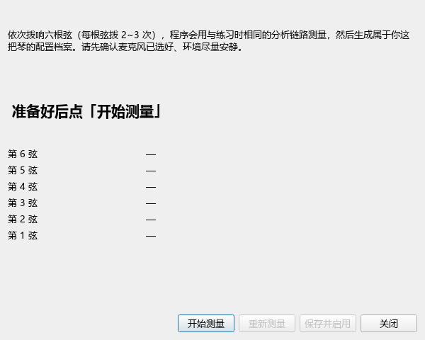
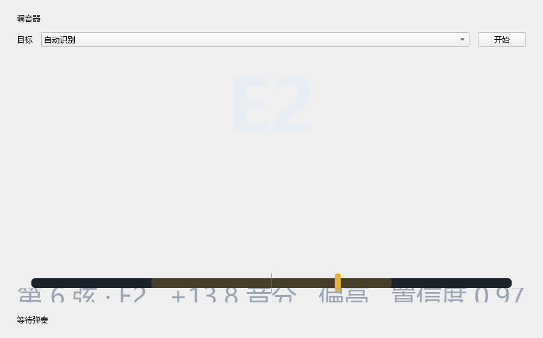
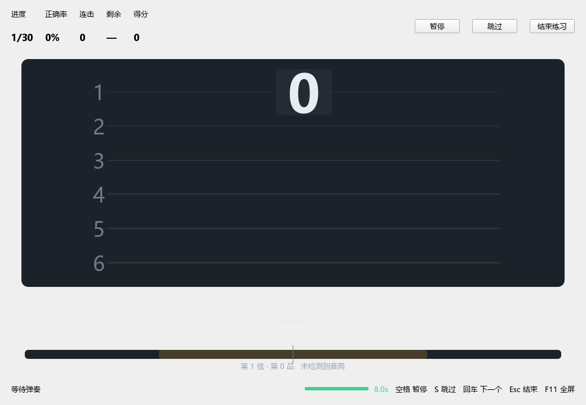
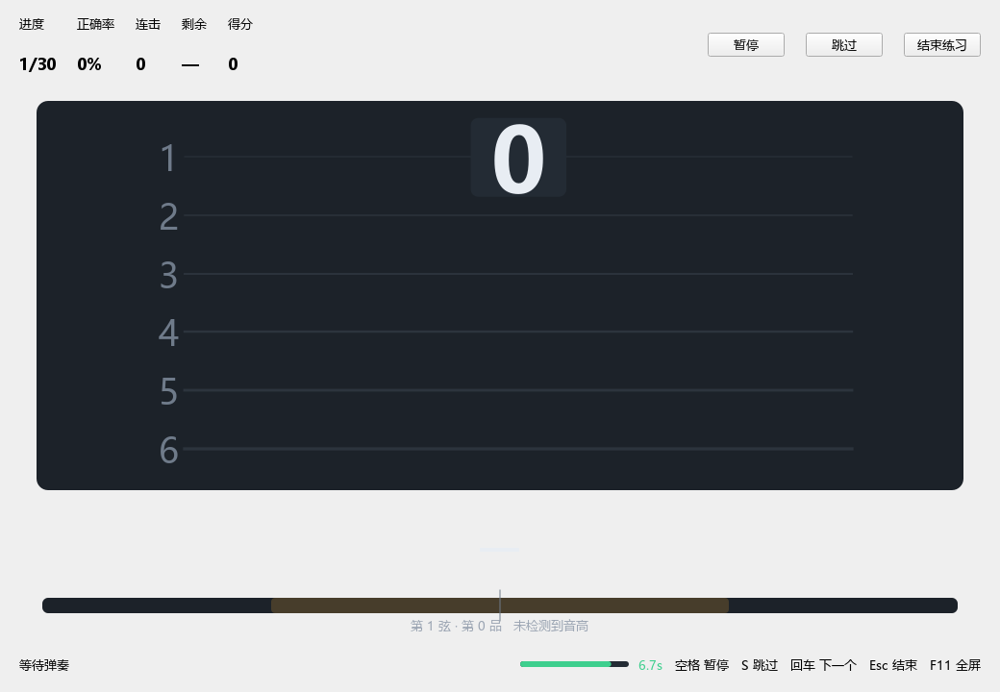
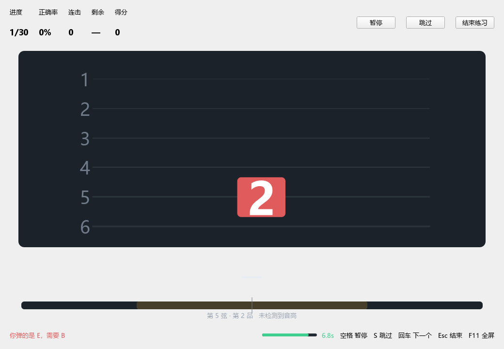
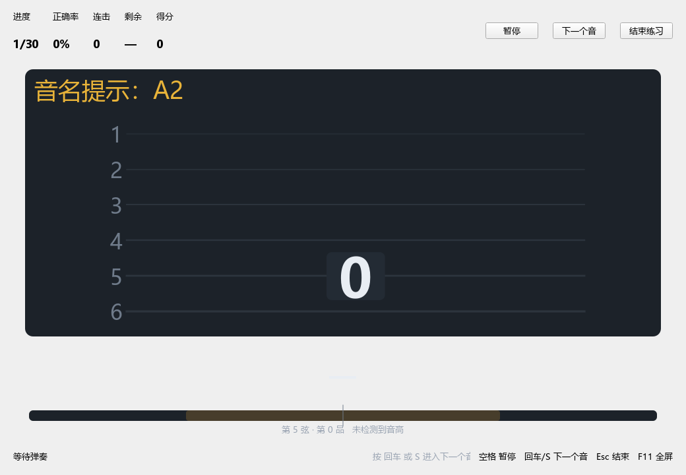
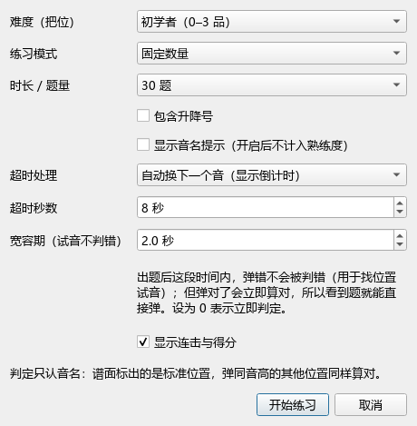
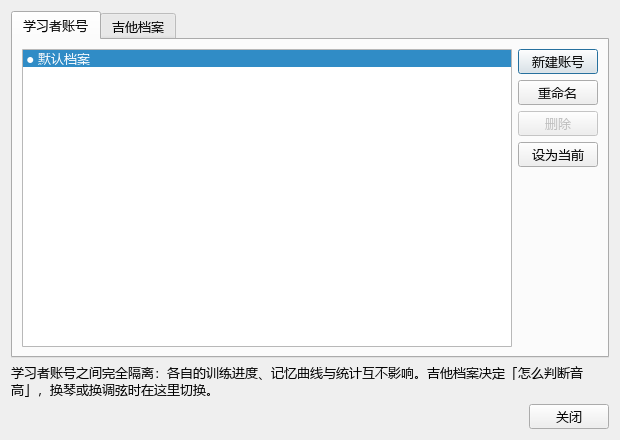
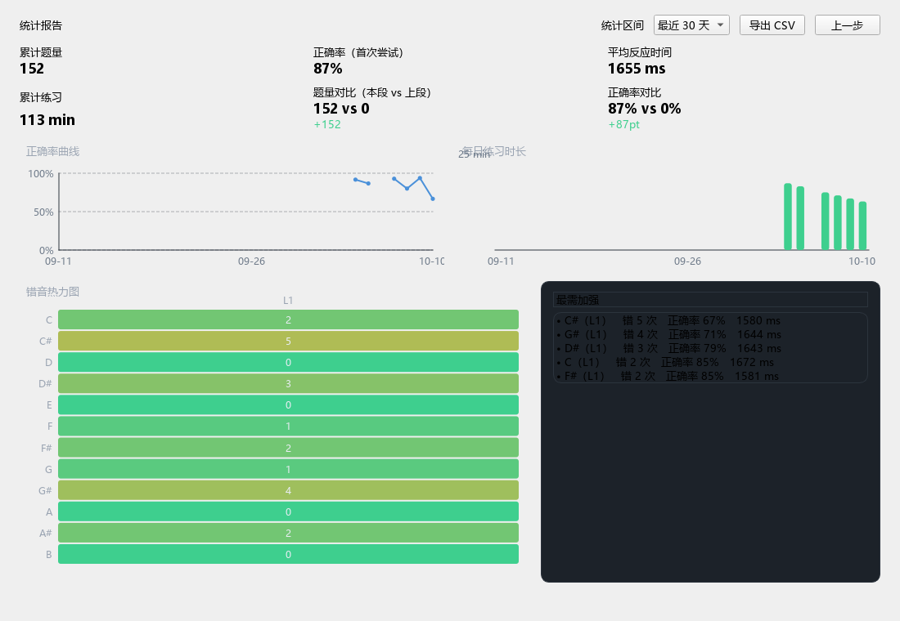

# JitaTrainer 软件使用说明（图文版）

**吉他训练器 · Windows 绿色版** —— 用麦克风听你弹吉他、判断音对不对，
并按照记忆曲线安排复习。

> 本文是**上手向**的图文说明。更细的条目（快捷键、参数含义、故障排查清单）见
> [用户手册](用户手册.md)；需求与设计见 [需求文档](需求文档.md)、[技术方案](技术方案.md)。

---

## 目录

1. [它长什么样](#1-它长什么样)
2. [安装与启动](#2-安装与启动)
3. [第一步：让程序认识你的吉他](#3-第一步让程序认识你的吉他)
4. [第二步：调音](#4-第二步调音)
5. [第三步：开始练习](#5-第三步开始练习)
6. [练习设置详解](#6-练习设置详解)
7. [账号与吉他档案](#7-账号与吉他档案)
8. [它是怎么安排复习的](#8-它是怎么安排复习的)
9. [统计报告](#9-统计报告)
10. [数据与备份](#10-数据与备份)
11. [程序能判断什么、不能判断什么](#11-程序能判断什么不能判断什么)
12. [常见问题](#12-常见问题)

---

## 1. 它长什么样


首页有三块入口：

| 卡片 | 用途 |
|---|---|
| **看谱找音** | 主功能。屏幕出现六线谱音符，你在吉他上弹出它 |
| **统计报告** | 正确率曲线、练习时长、错音热力图，可导出 CSV |
| **调音器** | 指针式显示六根弦的音准偏差 |
| **首次运行向导** | 选麦克风、测环境噪声、试弹校准 |

下方信息区一眼能看到当前**学习者账号**、**乐器档案**、输入设备、起音门限、
**今日待复习数量**与版本号。

---

## 2. 安装与启动

1. 把 `JitaTrainer` 整个文件夹解压到任意位置——**中文路径、带空格的路径都可以**。
2. 双击 `JitaTrainer.exe`。**不需要管理员权限**，不写注册表、不联网。

首次启动会弹出向导，三步走完：选麦克风 → 测环境噪声 → 试弹校准。

> **麦克风怎么选**：请**不要**用蓝牙音箱/耳机的麦克风。实测这类设备会把持续的
> 吉他音当成噪声做降噪处理（开发期实测 150 秒里只有 9 秒有信号，其余是数字静音）。
> 用有线麦克风或笔记本内置阵列。麦克风放在**音孔前 20~40 cm**、略偏琴桥。

---

## 3. 第一步：让程序认识你的吉他

不同的琴、不同的麦克风，"怎么判断音高"的最优做法不一样。程序不把这套策略写死，
而是放在**属于你这把琴的配置文件**里。

菜单「**乐器 → 测量我的吉他**」：



1. 点「开始测量」；
2. 按提示依次拨响 **6→5→4→3→2→1 弦**（每根弦拨 2~3 次，全程约 20 秒）；
3. 结束后会列出每根弦的实测频率与结论，并给出提示
   （例如"第 6 弦偏低 15 音分 → 建议先调音"）；
4. 点「**保存并启用**」。

测量用的是**与练习时完全相同的分析链路**，所以结果就是程序实际"听到"的样子。
生成的档案在 `data\instruments\` 下，是可以用记事本打开的 JSON 文件：

```json
{
  "format": "jitatrainer-instrument",
  "name": "我的吉他（2026-10-10 实测）",
  "strings": [
    { "number": 6, "note": "E2", "measured_hz": 81.71, "offset_cents": -14.6, "level_db": -33.6 },
    ...
  ],
  "detection": { "harmonic_mode": "auto", "low_enhance": true, "tolerance_cents": 25.0 },
  "max_fret": 12
}
```

**为什么要这么做**：早期版本为了迁就一支低频很差的麦克风，在程序里写死了一条
"低频谐波纠正"。换正常麦克风后，同一条规则反而**把正确的读数改错**（第 1 弦 E4
被砍成低八度）。实测表明单帧频谱无法可靠区分"真锁定"与"琴箱共振"，所以改成
**配置决定策略 + 用档案里的预期音高消解歧义 + 不符预期就提示你**。

程序会在这些情况下主动提示：

| 情况 | 提示 |
|---|---|
| 某根弦偏差 ≥ 20 音分 | 建议先调音 |
| 某根弦明显比其他弦弱 | 建议调整麦克风位置 |
| 各弦都差 ≥ 60 音分 | 可能换了调弦，建议新建档案 |
| 练习中连续出现"这把琴弹不出的音" | 提示检查麦克风摆位/增益 |

---

## 4. 第二步：调音

菜单或首页进入调音器：



- 上方可选择**自动识别**或指定某根弦；
- 指针居中表示音准；两侧显示音分偏差；
- 目标音高来自你的**乐器档案**——换成降半音档案后，第 1 弦的目标会自动变成 D#4。

**先把琴调准再练**：音准偏差太大（超过判定容差 ±25 音分）会频繁误判。

---

## 5. 第三步：开始练习

首页点「看谱找音」→ 选难度与模式 → 开始练习。

### 5.1 出题后先"试音"



每题出现后有 **2 秒宽容期**（可调）。这段时间里：

- **弹错不会被判错**——方便你先找位置、试音；
- **弹对了会立即算对**——所以看到题就可以直接弹，不必等。

底部会显示「**试音中 1.4s**」，让你知道程序已经听到了、只是还没计入判定。

### 5.2 到时间自动换题（带倒计时）



宽容期结束后开始计时，底部进度条显示**距离自动换下一个音还有多久**，
颜色随剩余时间由绿转黄再转红。到时间自动进入下一题，本题记为"不会"
（计入薄弱项并排进回炉队列）。

### 5.3 弹错了会怎样



- 音符框变**红色**；
- 反馈文字告诉你「**你弹的是 C，需要 G**」；
- 谱面上**高亮标准位置**（图中第 1 弦第 3 品）；
- **停留当前题，直到弹对**（需求 FR-537）；错几次记几次，用于熟练度与统计。

### 5.4 不想被时间催？改成人工推进

在练习设置里把「超时处理」改成**人工推进**：



- 不再显示倒计时，也**不会自动换题**；
- 按 `回车`、`N` 或 `S` 才进入下一个音；
- 这张图同时演示了开启「**显示音名提示**」的样子（谱面上方显示 `音名提示：x`）——
  注意带提示答对**不计入熟练度**，只是帮你认谱。

**快捷键**：`空格` 暂停/继续 ・ `S` 跳过 ・ `回车`/`N` 下一个音 ・ `Esc` 结束 ・ `F11` 全屏

### 5.5 题目角落的来源标签

| 标签 | 含义 |
|---|---|
| （无） | 新题 |
| `复习` | 记忆曲线安排的到期复习 |
| `强化` | 你在这类音上错得比较多，加强练习 |
| `回炉` | 刚才答错的题，隔几题再问你一次 |

---

## 6. 练习设置详解

点「开始练习」时会弹出设置：



| 项目 | 说明 |
|---|---|
| **难度（把位）** | L1 初学 0–3 品 / L2 入门 0–5 品 / L3 进阶 0–7 品 / L4 全指板 0–12 品 |
| **练习模式** | 固定数量（10/20/30/50/100 题）、固定时长（5/10/15/30/45 分钟）、自由练习 |
| **包含升降号** | 是否把 # / b 的音也纳入出题 |
| **显示音名提示** | 谱面直接显示音名；**开启后本题不计入熟练度** |
| **超时处理** | 自动换下一个音（显示倒计时）／人工推进（不自动换题） |
| **超时秒数** | 自动模式下的等待时间，默认 8 秒 |
| **宽容期** | 试音保护时长，默认 2 秒；设为 **0** 表示立即判定 |
| **显示连击与得分** | 是否在顶栏显示连击与得分 |

---

## 7. 账号与吉他档案

菜单「**账号与档案**」：



### 学习者账号

- 不同账号之间**完全隔离**：训练进度、记忆曲线、统计互不影响（适合多人共用一台电脑）；
- 可**新建 / 重命名 / 删除 / 设为当前**，当前账号用 `●` 标记；
- 只剩一个账号时禁用删除；删除当前账号会自动切到剩下的；
- 程序记住上次用的账号，下次启动直接进入。

语言、麦克风设备、乐器档案属于全局设置，所有账号共用。

### 吉他档案

- 列出 `data\instruments\` 下的档案（标注是否实测过）；
- **测量新吉他…**（见第 3 节）／**设为当前**／**重命名**／**删除**／**查看**；
- 换琴或换调弦时在这里切换，调音器与判定策略会一起跟着变。

---

## 8. 它是怎么安排复习的

- 每个训练项 = **音名 × 把位区间**（例如「E 音在 L2 区间」）；
- 答对 → 下次复习时间往后推：**1 → 3 → 7 → 16 → 35 → 75 → 160 天**；
- 答错 / 跳过 / 超时 → 回到"当天"，并排进**回炉队列**，隔 5~8 题再问一次；
- 同一题**连续两次答对**才移出回炉队列；
- 每 10 题大致按 **4 题复习 + 3 题强化 + 3 题新题** 配比；某一类没有可出的题时配额顺延。

**难度建议**：当你某难度最近 3 次练习都达到「正确率 ≥ 90%、平均反应 ≤ 2.5 秒、
累计 ≥ 60 题」时，首页会提示可以进入下一难度。程序**只建议，不自动切换**。

---

## 9. 统计报告



- **KPI**：累计题量、正确率、平均反应时间、累计练习时长，以及本段与前一段的对比；
- **正确率曲线**：逐日正确率；
- **练习时长**：逐日练习分钟数；
- **错音热力图**：12 个音名 × 各级别，越红错得越多，格子里是错误次数；
- **最需加强**：错误率最高的几个训练项；
- 右上可切换统计区间（7 / 30 / 90 天）并**导出 CSV**（答题明细 + 逐日汇总，
  UTF-8 BOM 编码，Excel 双击不乱码）。

---

## 10. 数据与备份

**数据都在程序目录下的 `data\` 文件夹**——把整个文件夹拷走就是完整备份。

```
JitaTrainer\
├─ JitaTrainer.exe
├─ data\
│  ├─ jitatrainer.db      ← 全部练习数据
│  ├─ instruments\        ← 你的吉他档案（每把琴一个 JSON）
│  ├─ backups\            ← 自动备份（保留最近 10 份）
│  └─ exports\            ← CSV / 档案导出的默认位置
└─ logs\
   └─ jitatrainer.log     ← 出问题时的排查依据
```

**自动备份**：每次启动、每次练习结束、以及清空数据前各做一次，保留最近 10 份。
备份用的是 SQLite 在线备份接口，即使程序正在写入也能拿到一致快照。

菜单「数据」里可以：打开数据目录 / 立即备份 / 导出档案 / 导入档案 / 清空本档案统计。
档案导出为单个 JSON（含训练项、会话、答题明细与设置），可在别的电脑导入。

---

## 11. 程序能判断什么、不能判断什么

> 本程序通过麦克风判断**音高**，**无法**知道你按的是哪根弦、哪个品。
> 当题目标注"第 5 弦第 2 品"时，你在别的弦上弹出**同样的音**同样算通过。
> 标注位置的作用是帮你建立指板地图，而不是限制你必须按在那里。

| 能判断 | 不能判断 |
|---|---|
| 你弹的音名对不对（C、D、E…） | 你按的是第几弦第几品 |
| 音准偏了多少音分 | 指法、手型、拨弦方式 |
| 反应快慢、是否犹豫 | 音色、力度是否好听 |
| 同一音名的不同八度**不区分** | 节奏是否准确 |

---

## 12. 常见问题

**弹了没反应？**

1. 看底部是不是显示「试音中」——那表示程序听到了，只是还在宽容期（不计入判定）；
2. 确认「校准向导」里选对了麦克风、电平条会随弹奏跳动；
3. 检查 Windows 隐私设置允许桌面应用使用麦克风；
4. 蓝牙耳机/音箱请换成有线设备（见第 2 节）。

**低音弦（6 弦 E、5 弦 A）判定不灵？**

笔记本内置麦克风对 60–150 Hz 响应较差。建议：麦克风靠近音孔一些、
在校准向导里调低起音门限、或换一支频响更好的有线麦克风。
另外**先跑一次第 3 节的"测量我的吉他"**，让程序按你的实际情况调整策略。

**明明弹对了却判错？**

先确认琴调准了（用调音器）。整体偏低几十音分就可能落在容差（默认 ±25 音分）之外。
也可以把「稳定时长」调成「稳健」，或在设置里放宽音准容差。

**弹错了却算我对？**

判定只看音名。如果你弹的音和答案**音名相同、只是八度不同**，程序会算对——
这是设计如此（见第 11 节）。

**程序起不来？**

换个路径再试（中文与空格路径都支持）；查看 `logs\jitatrainer.log` 最后几行；
或在命令行运行 `JitaTrainer.exe --selftest`，它会打印环境自检结果并写入
`logs\selftest.json`。

**会联网吗？会收集数据吗？**

不会。程序完全离线运行，不联网、不注册、不上传任何数据。

---

## 附：开发者相关信息

| 用途 | 命令 |
|---|---|
| 环境自检 | `python tools\doctor.py --audio --tests` |
| 单元测试 | `python -m pytest` |
| 性能测量 | `python tools\bench.py` |
| 从录音测量吉他 | `python tools\measure_guitar.py 录音.m4a --name "我的吉他"` |
| 打包绿色版 | `python tools\build.py --clean` |
| 产物自检 | `JitaTrainer.exe --selftest` |
